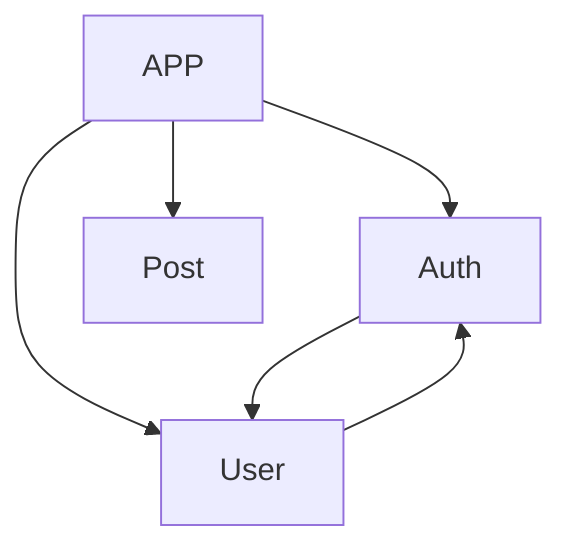

# [ Pet Care ] 반려동물 캘린더 앱 서버입니다.

반려동물 일정 기록 & SNS 서비스로 기획, 개발 기간은 2023.06 ~ 현재로 진행 중입니다.

# ⚙️ 개발 환경

### 에디터

- Visual Studio Code
- Mysql Workbench
- MongoDB Compass

# 🔨 Tech Skills

### 인프라

### 언어 / 프레임워크

- TypeScript
- NestJs

### 데이터베이스

- MongoDB (Mongoose)

### Module Structure

- User : 로그인, 회원가입 관련 모듈
- Post : 게시글(작성, 삭제 등) 관련 모듈
- Auth : 인증, 토큰 관련 모듈

# 🧱 시스템 구조도

- 업데이트 예정

# ✏️ DB ERD

# 🔍 Test

## Jest/Supertest

# 🚫 개선 및 구현이 필요한 문제들

# 📌 해결했던 문제들

## 로그인 유지 기한 문제

Access Token의 기한이 짧아 Access Token을 자주 재발급하는 문제가 발생하였습니다.
사용자가 로그아웃하거나 세션이 만료되어도 Refresh Token 인증을 통해 새로운 Access Token을 얻을 수 있도록 로직을 구성하였습니다.
이를 통해 사용자가 다시 인증할 필요가 없어 다시 인증해야 하는 번거로움과 잦는 API 호출로 인한 서버 부하를 방지합니다.

# ❕ 느낀점
